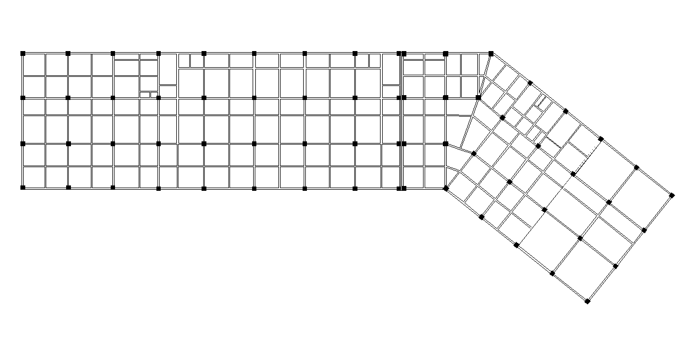
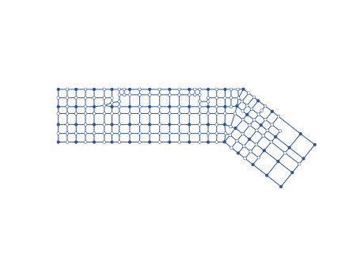

# StrucDetect
将结构拓扑像素图转化为对应的图表征的工具  

## 用法
git clone https://github.com/Mocifiel/StrucDetect.git  
cd StrucDetect  
pip install -r requirements.txt  
cd src  
python StrucDetect.py --data_dir ../data --sheet_dir ../sheets/ --graph_dir ../graphs  
更多参数请参照python StrucDetect.py -h  

## 重要参数说明
- data_dir: type=str, 存放结构拓扑像素图的路径, default="../data/"
- sheet_dir: type=str, 输出图表征的节点特征文件和边列表文件的路径, default="../sheets/"
- graph_dir: type=str, 输出图表征的可视化svg文件的路径, default="../graphs/"
- img_width: type=int, default=1280, help="width of input images in pixel, default 1280"
- img_height: type=int,default=640,  help="height of input images in pixel, default 640"
- beam_width: type=int,default=8, help="parameter for connecting the detected lines, default 8"
- colu_width: type=int,default=15,help="parameter for connecting the detected lines, default 15"
- disable_detect_diag_line: action="store_true", help="disable detecting diagonal lines, default False"
- deg_gap: type=int, default=6, help="the resolution used to categorize line segments by angle, measured in degrees, default 6"
- max_dist: type=int,default=24,help="the threshold for determining whether two lines intersect, default 24"
- clst_radius: type=int,default=15,help="the threshold used to aggregate nodes together, default 15"
- enable_show_intermediate_result: action="store_true", help="enable showing intermeidate results, default False"

