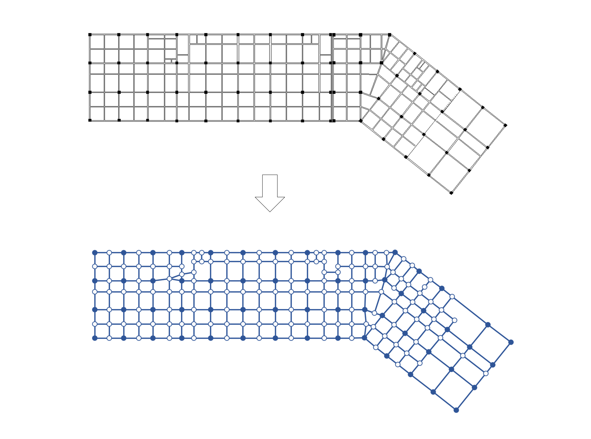

# StrucDetect
将结构拓扑像素图转化为对应的图表征的工具

## 用法
git clone https://github.com/Mocifiel/StrucDetect.git  
cd StrucDetect  
pip install -r requirements.txt  
cd src  
python StrucDetect.py --data_dir ../data --sheet_dir ../sheets/ --graph_dir ../graphs  
更多参数请参照python StrucDetect.py -h  

## 重要参数说明
- data_dir: type=str, 存放结构拓扑像素图的路径, default="../data/"
- sheet_dir: type=str, 输出图表征的节点特征文件和边列表文件的路径, default="../sheets/"
- graph_dir: type=str, 输出图表征的可视化svg文件的路径, default="../graphs/"
- img_width: type=int, 输入像素图的宽度
- img_height: type=int, 输入像素图的高度
- beam_width: type=int, 用以连接线段的参数，default=8
- colu_width: type=int, 用以连接线段的参数，default=15
- disable_detect_diag_line: type=bool, 是否关闭检测斜向线段功能，default=False
- deg_gap: type=int, 用以将线段按角度分类的分辨率，单位deg, default=6
- max_dist: type=int, 判断两条线是否相交的阈值，default=24
- clst_radius: type=int, 用来将节点聚合的阈值，default=15
- enable_show_intermediate_result: type=bool, 是否显示中间过程，default=False

